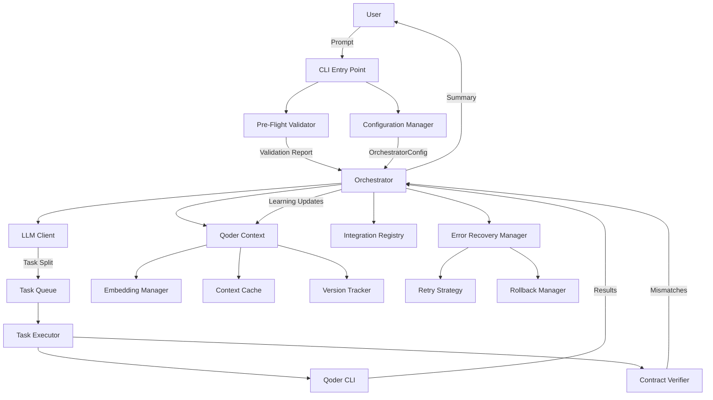
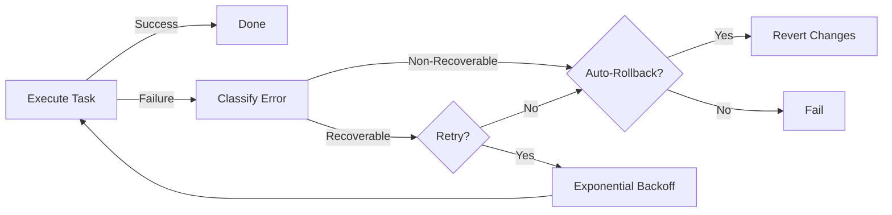
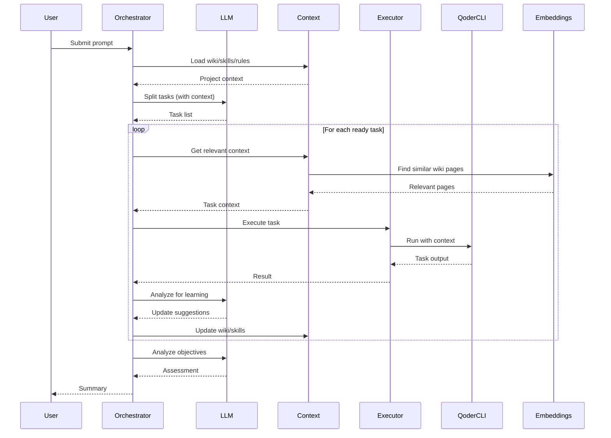
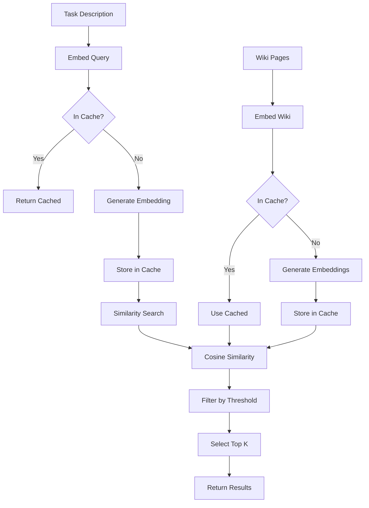
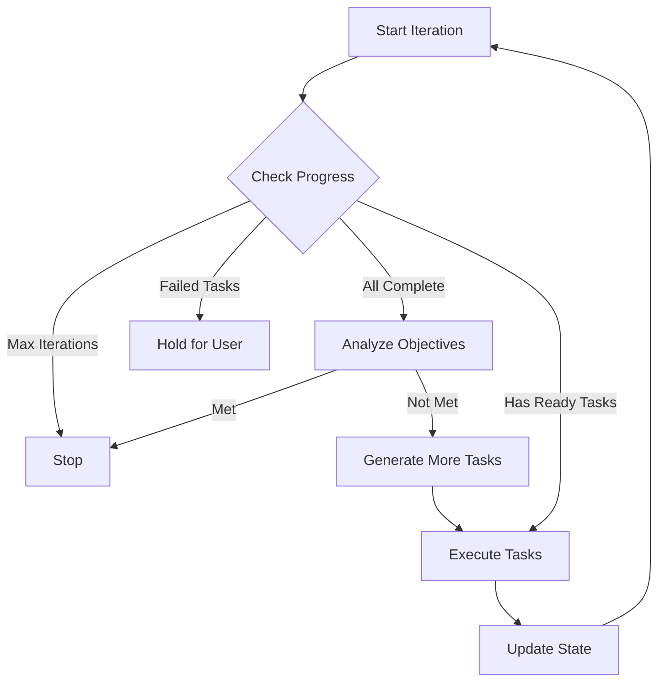

# System Architecture

This document provides a comprehensive overview of the Qoder orchestration system architecture.

## High-Level Architecture



## Component Overview

### 1. Configuration Manager (`config.py`)

**Purpose**: Centralized configuration management with multiple sources

**Key Features**:
- YAML file support (`.qoder-orchestrate.yaml`)
- Environment variable overrides
- CLI argument precedence
- Validation of configuration values

**Configuration Hierarchy** (highest to lowest priority):
1. CLI arguments
2. Environment variables
3. YAML config file
4. Defaults

### 2. Pre-Flight Validator (`validation.py`)

**Purpose**: Validate environment before orchestration begins

**Checks**:
- Git repository status
- Qoder CLI installation and version
- Python dependencies
- Project structure
- Qoder context (wiki/skills/rules)

**Output**: Detailed validation report with errors, warnings, and fix suggestions

### 3. Error Recovery Manager (`error_handling.py`)

**Purpose**: Handle failures gracefully with retry and rollback

**Components**:
- **Retry Strategy**: Exponential backoff with configurable attempts
- **Rollback Manager**: Git-based checkpoints and rollback
- **Error Classification**: Categorize errors as recoverable/non-recoverable

**Recovery Flow**:


### 4. LLM Client (`llm_client.py`)

**Purpose**: Abstract LLM interactions across providers

**Supported Providers**:
- Qoder CLI (default)
- OpenAI (GPT-4, etc.)
- Anthropic (Claude)

**Operations**:
- **Task Splitting**: Break down high-level prompts into granular tasks
- **Objective Analysis**: Determine if original goals are met
- **Learning Suggestions**: Recommend wiki/skill updates

### 5. Context Management

#### Qoder Context (`cli.py`)
Manages project-specific context (wiki, skills, rules)

#### Embedding Manager (`embeddings.py`)
**Purpose**: Semantic search for relevant context

**Features**:
- Sentence transformer embeddings
- Similarity-based retrieval
- Embedding caching
- Keyword fallback when embeddings unavailable

#### Context Cache (`context_cache.py`)
**Purpose**: Performance optimization through caching

**Features**:
- LRU eviction policy
- Disk persistence
- TTL-based expiration
- Size limits

#### Version Tracker (`versioning.py`)
**Purpose**: Track context versions and detect changes

**Features**:
- Content hashing for wiki/skills/rules
- Dependency fingerprinting
- Incremental update detection
- Task version history

### 6. Contract Verifier (`contract_verifier.py`)

**Purpose**: Ensure frontend/backend API contracts stay in sync

**Features**:
- Extract contracts from code (Python, JavaScript)
- OpenAPI spec support
- Mismatch detection and reporting
- Severity classification (error/warning)

### 7. Integration Registry (`cli.py`)

**Purpose**: Track shared state between components

**Tracks**:
- Shared data models
- API contracts
- Cross-component dependencies
- Last sync timestamps

## Data Flow

### Task Execution Flow



### Context Retrieval Flow



## Execution Modes

### Sequential Mode
Tasks execute one at a time, respecting dependencies.

### Parallel Mode (Default)
Independent tasks execute concurrently with:
- Dependency checking
- File conflict detection
- Configurable parallelism limit

### Speculative Mode
Predict and start likely-needed tasks before dependencies complete.

### Batch Mode
Group similar tasks for efficient execution.

## Decision Making



## File Organization

```
qoder_orchestrator/
├── __init__.py
├── cli.py                    # Main orchestrator and CLI entry point
├── config.py                 # Configuration management
├── validation.py             # Pre-flight validation
├── error_handling.py         # Retry and rollback
├── llm_client.py            # LLM abstraction
├── embeddings.py            # Semantic search
├── context_cache.py         # Context caching
├── versioning.py            # Context versioning
└── contract_verifier.py     # API contract verification
```

## Extension Points

### Adding New LLM Providers
1. Extend `LLMClient` abstract class
2. Implement required methods
3. Register in `create_llm_client()` factory

### Custom Validation Rules
1. Extend `PreFlightValidator`
2. Add custom validation methods
3. Call from `validate_all()`

### Custom Error Recovery
1. Extend `RetryStrategy` or `RollbackManager`
2. Override recovery logic
3. Inject into `ErrorRecoveryManager`

## Performance Considerations

### Caching Strategy
- **Embeddings**: Cached indefinitely (invalidated on content change)
- **Context**: TTL-based (default 1 hour)
- **LLM Responses**: Not cached (tasks are unique)

### Parallelization
- Default: 3 parallel tasks
- Increase for I/O-bound workloads
- Decrease for CPU/memory-intensive tasks

### Memory Usage
- Embeddings model: ~100MB
- Context cache: Configurable (default 100MB)
- Per-task overhead: ~1-5MB

## Security

### Secrets Management
- PAT stored in `.env.local` (gitignored)
- API keys via environment variables
- No secrets in configuration files

### Sandboxing
- Tasks execute in project directory
- No system-wide modifications
- Git-based rollback for safety
